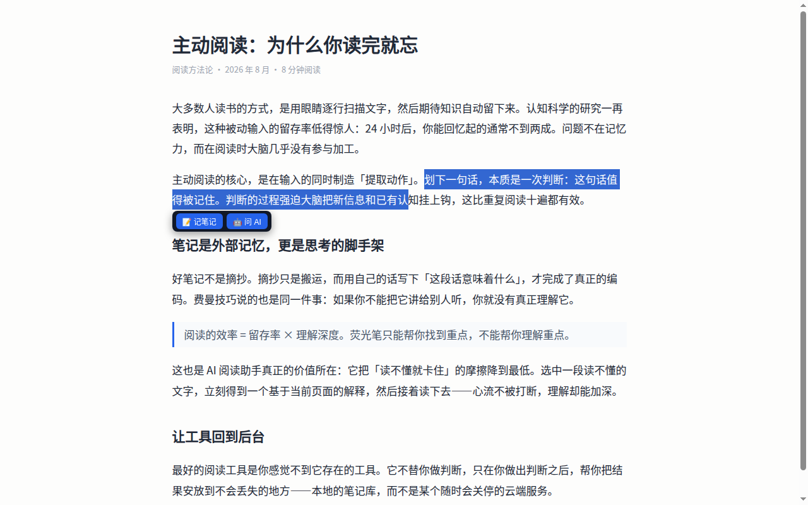
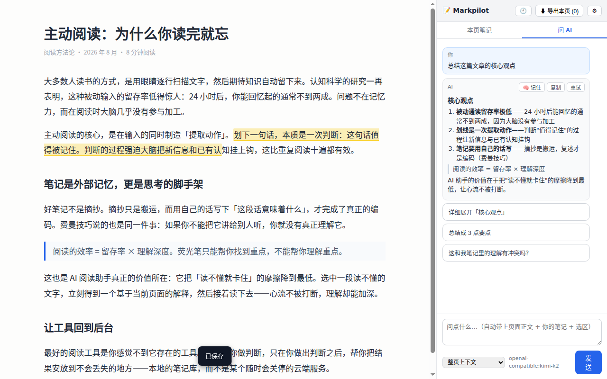
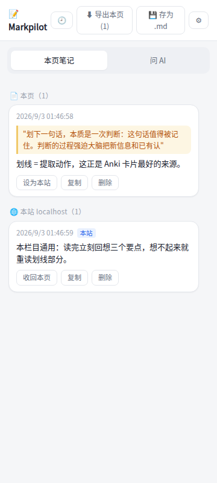

# Markpilot — Web Notes to Obsidian & AI

Highlight, take notes, and ask AI right on any web page. Notes and AI Q&A export to your local Obsidian vault; everything stays on your own device.

## Screenshots

| Selection toolbar | AI chat in the side panel | Page-level / site-level notes |
|---|---|---|
|  |  |  |

## Features

- **Highlight & note anywhere** — select text on any page, jot a thought in one click; highlights restore on reload
- **Page-level / site-level notes** — notes stick to a single page (tracking params stripped, content params kept) or go site-wide in one click
- **Ask AI in context (BYOK)** — the selected text, page content, and your notes go to the LLM you configured: DeepSeek, Zhipu GLM, Moonshot Kimi, Alibaba Qwen, OpenRouter, Anthropic, OpenAI-compatible endpoints, opencode free models, or local Ollama
- **Obsidian / Markdown export** — one click to a vault folder (File System Access), the Local REST API plugin, or a plain `.md` download
- **Long-term memory** — Markdown memory files in your vault, hybrid retrieval (lexical + on-device embeddings) injected into future questions
- **10 languages** — UI follows your browser locale

## Technical highlights

- **On-device vector search under MV3 CSP** — transformers.js ships as a prebuilt ESM inside the extension bundle, with the ONNX wasm binaries packed alongside (`dist/lib/wasm/`), so no remote code ever loads (MV3 CSP forbids it). Embeddings run single-threaded because the threaded backend would spawn blob workers, which extension-page CSP blocks. See [`src/lib/embedding.ts`](src/lib/embedding.ts).
- **Zero-install-warning permissions** — no `host_permissions` at all. Host access is computed from your settings ([`requiredOrigins`](src/lib/llm/index.ts)) and requested at runtime inside a user gesture (`chrome.permissions.request`), with a friendly guard ([`ensureHostPermission`](src/lib/llm/index.ts)) before every fetch. Installing the extension shows no "read all your data on all websites" prompt for host access.
- **Two-channel page-text extraction** — the primary path is a `page:get-text` message to the isolated-world content script ([`src/content/annotator.js`](src/content/annotator.js)); the fallback injects the extractor into the MAIN world on demand via `chrome.scripting.executeScript` for tabs that predate the extension. See [`extractPageText`](src/lib/chat-pipeline.ts).
- **Memory retrieval with automated evals** — the hybrid retriever is regression-tested against a 40-memory corpus with 37 labeled queries: **recall@5 97.0% / precision@5 66.7% / abstention 100%**. Methodology and full engineering journal: [docs/MEMORY-EVAL.md](docs/MEMORY-EVAL.md), [docs/MEMORY-EVAL-PLAYBOOK.md](docs/MEMORY-EVAL-PLAYBOOK.md), [archive/memory-eval/JOURNAL.md](archive/memory-eval/JOURNAL.md).

Design deep-dive: [docs/DESIGN.md](docs/DESIGN.md) · Memory system status: [docs/MEMORY-STATUS.md](docs/MEMORY-STATUS.md)

---

# Markpilot（中文）

网页划词笔记 → 本地 Obsidian → LLM 问答 浏览器扩展。Chrome 商店名：**Markpilot — Web Notes to Obsidian & AI**。设计见 [docs/DESIGN.md](docs/DESIGN.md)。

## MVP 加载（Chrome/Edge）

1. `npm install && npm run package`（产出可直接加载的 `release/markpilot/` 目录）
2. 打开 `chrome://extensions` → 开启「开发者模式」→「加载已解压的扩展程序」→ 选择 `release/markpilot/` 目录
3. 点击工具栏图标打开侧栏；⚙ 进入设置：配置 provider/model/key，并授权 Obsidian vault 目录（或选择 Local REST API 插件导出方式）
4. 在任意网页选中文字 → 「📝 记笔记」或「🤖 问 AI」

## 结构

- `src/content/annotator.js` — 划词捕获 / 字符偏移锚定 / 重高亮（notes.js 移植），兼正文提取消息主路径
- `src/content/extract.js` — 正文提取的 executeScript 兜底：由 `extractPageText` 按需以 MAIN world 注入（覆盖扩展安装前打开的旧标签页），算法实现为简化版 Readability（`src/lib/page-extract.js`）
- `src/lib/db.js` — IndexedDB（pages/notes/handles/settings）
- `src/lib/url-key.js` — 笔记「本页 / 本站」两级 key（page = URL 去跟踪参数、保留 ?id= 类内容参数；site = 域名互通）
- `src/lib/obsidian.js` — 三通道导出（fs-access 目录授权主通道 / obsidian:// URI 兜底 / Local REST API 插件）
- `src/lib/embedding.ts` — 端侧向量召回（transformers.js + 包内 wasm），向量缓存进 IndexedDB
- `src/lib/llm/` — provider 抽象 + SSE 流式 + 上下文构建器 + 按需 host 权限（`requiredOrigins` / `ensureHostPermission`）
- `src/panel/` — side panel 笔记列表 + 聊天

## Memory 系统与检索评测

长期记忆（Markdown 文件存 vault）+ 混合检索（词法 sparse + 端侧向量 dense）。设计文档见 [docs/MEMORY-DESIGN.md](docs/MEMORY-DESIGN.md) / [docs/MEMORY-EVAL.md](docs/MEMORY-EVAL.md)。

> **一页总览：[docs/MEMORY-STATUS.md](docs/MEMORY-STATUS.md)**（已上线 / 已验证 / 指标 / 下一步）

检索系统带一套**自动化评测体系**（40 条记忆语料 + 37 条标注查询，recall@5 97.0% / precision@5 66.7% / 拒答 100%）：

- [docs/MEMORY-EVAL-PLAYBOOK.md](docs/MEMORY-EVAL-PLAYBOOK.md) — 评测方法论与复刻指南（怎么建数据集、怎么跑、指标口径）
- [archive/memory-eval/JOURNAL.md](archive/memory-eval/JOURNAL.md) — **全程工程日志**：优化过程的完整回放（每个决策的证据、被数据否决的 6 个方案）
- [docs/plans/memory-opt-roadmap.md](docs/plans/memory-opt-roadmap.md) — 分阶段优化路线图与达标记录
- [archive/memory-eval/](archive/memory-eval/) — 执行报告与模型选型探针脚本

复跑评测：`npm run build && node tests/eval-memory.mjs`（端侧模型免 key；A/B 通道见 PLAYBOOK）

## License

[MIT](LICENSE)
